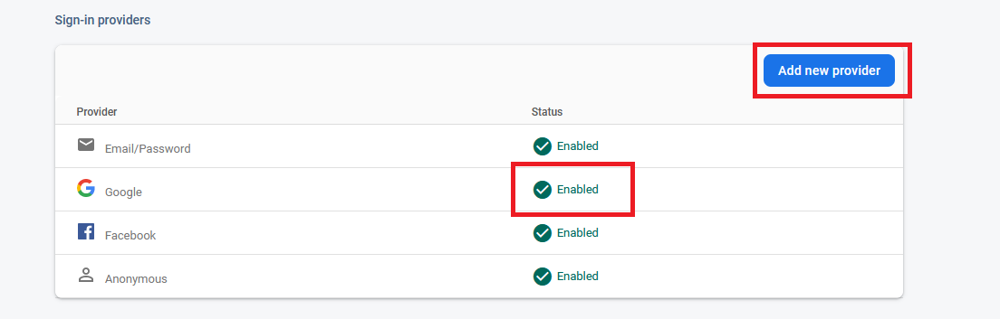

# Generate/signing your app

--- 
Link: (https://developers.google.com/android/guides/client-auth)

1. Google Sign In
    - Go to firebase [console](https://console.firebase.google.com/).
    - Enable **Google Sign-in Method** 
    - Generate 