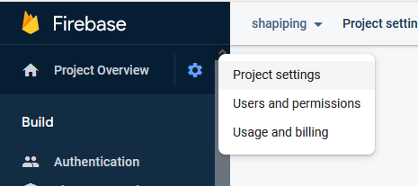
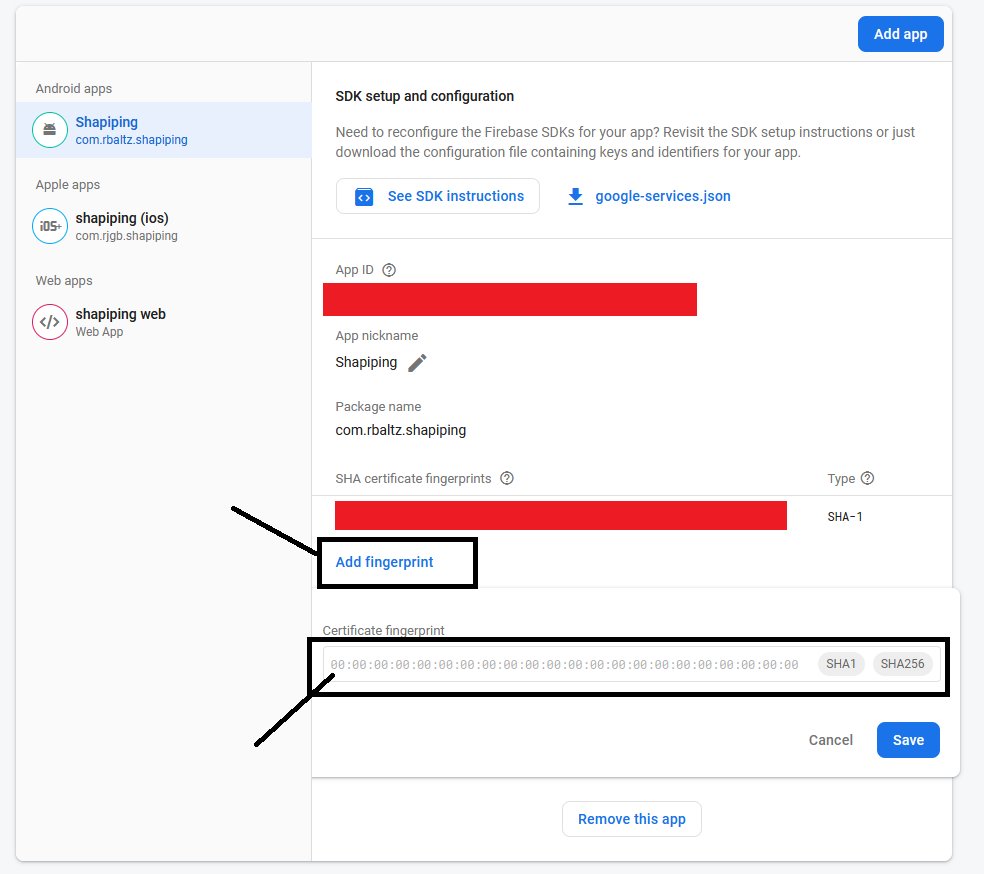

# Generate/signing your app

--- 
[Reference Link](https://developers.google.com/android/guides/client-auth)

1. Google Sign In
    1. Go to firebase [console](https://console.firebase.google.com/).
    2. Enable **Google Sign-in Method** 
    3. Generate debug certificate fingerprint. Open your terminal and run `keytool -list -v -alias androiddebugkey -keystore %USERPROFILE%\.android\debug.keystore` starting from the path of your Java.
    4. It will generate MD5, SHA1 and SHA256 keys.
    5. Copy the SHA1 key.
    6. In your firebase console, go to project settings 
    7. Click **Add Fingerprint** and paste the SHA1 key that you copied earlier. 

2. Facebook Sign In
    1. Go to [facebook developers](http://developers.facebook.com/)
